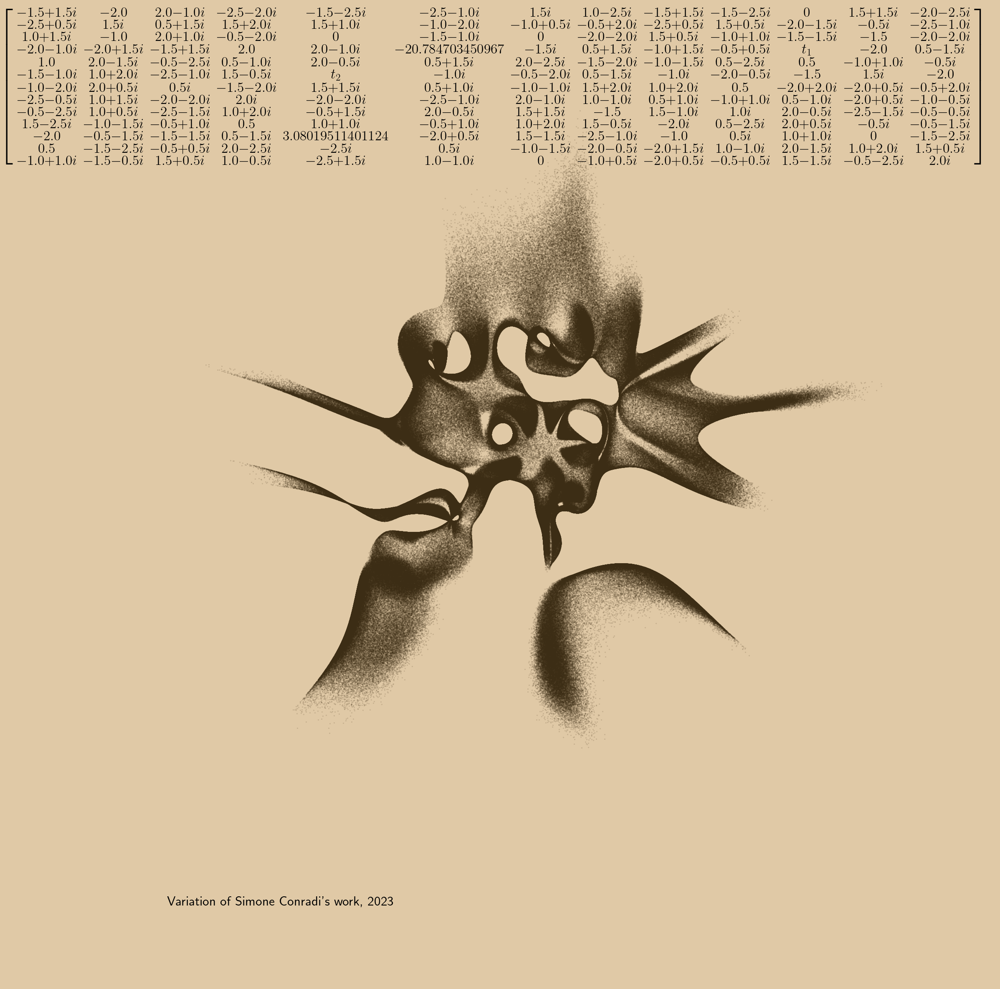
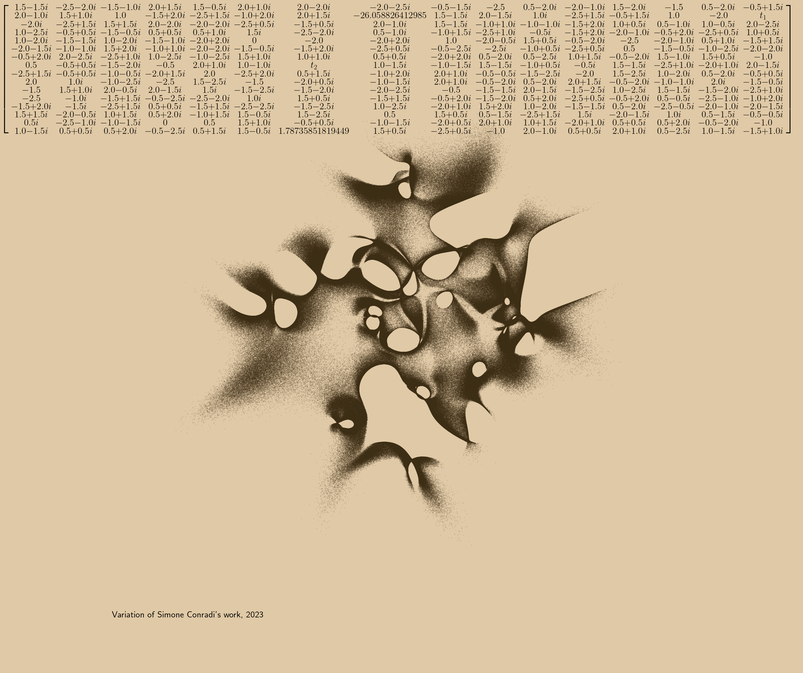
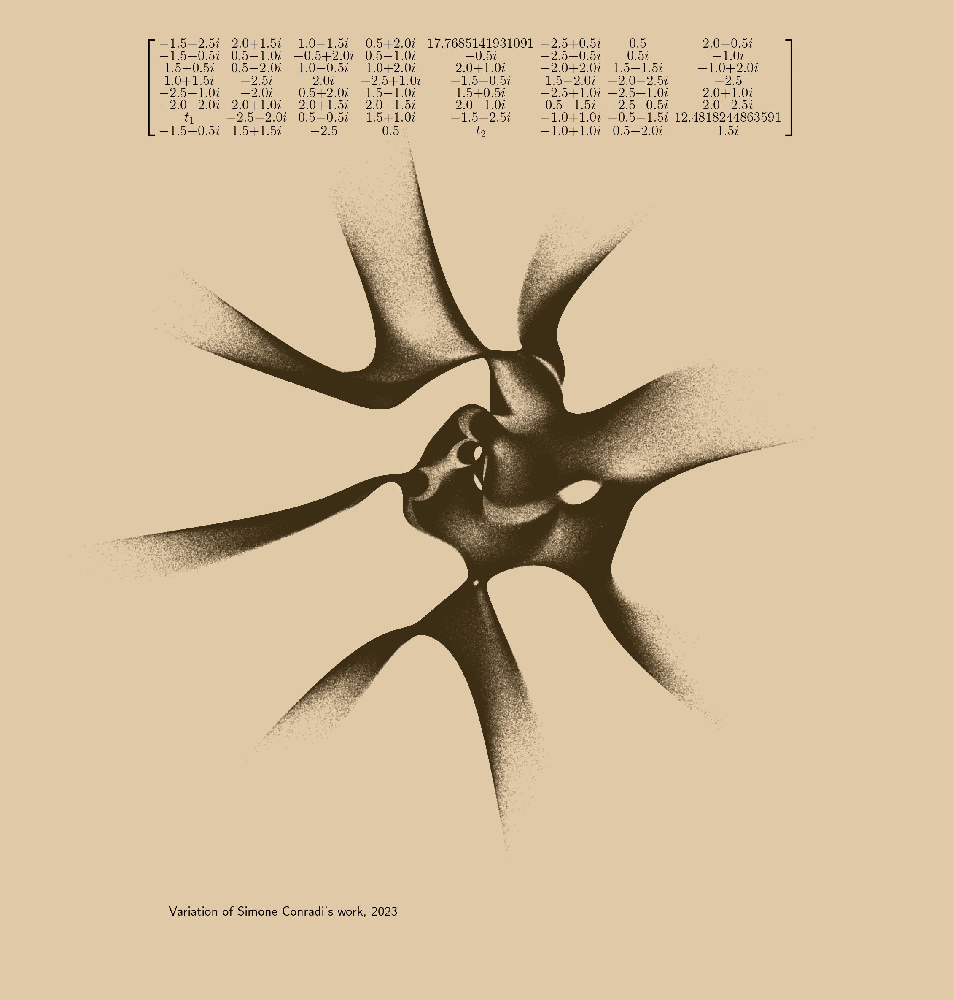
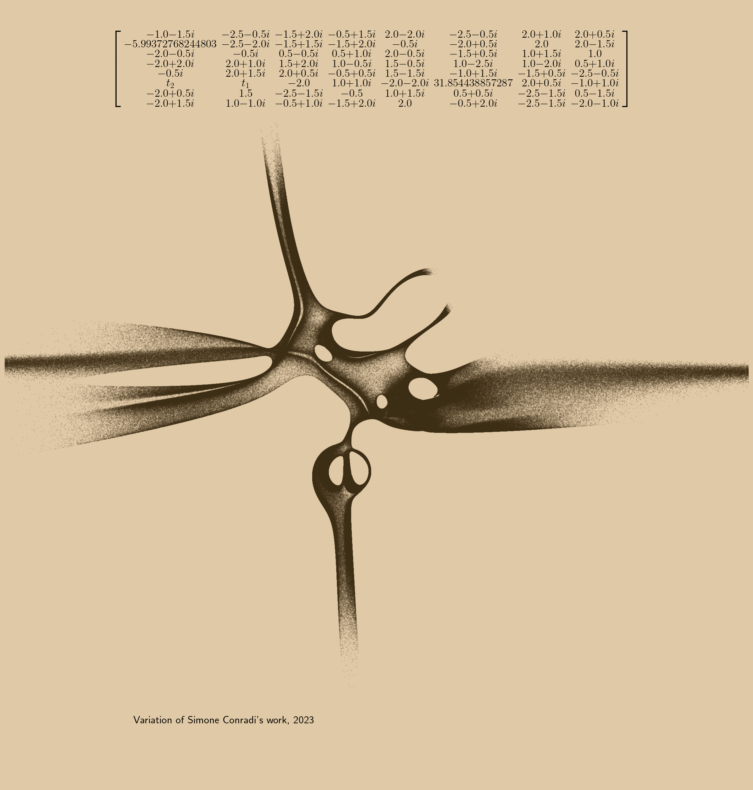
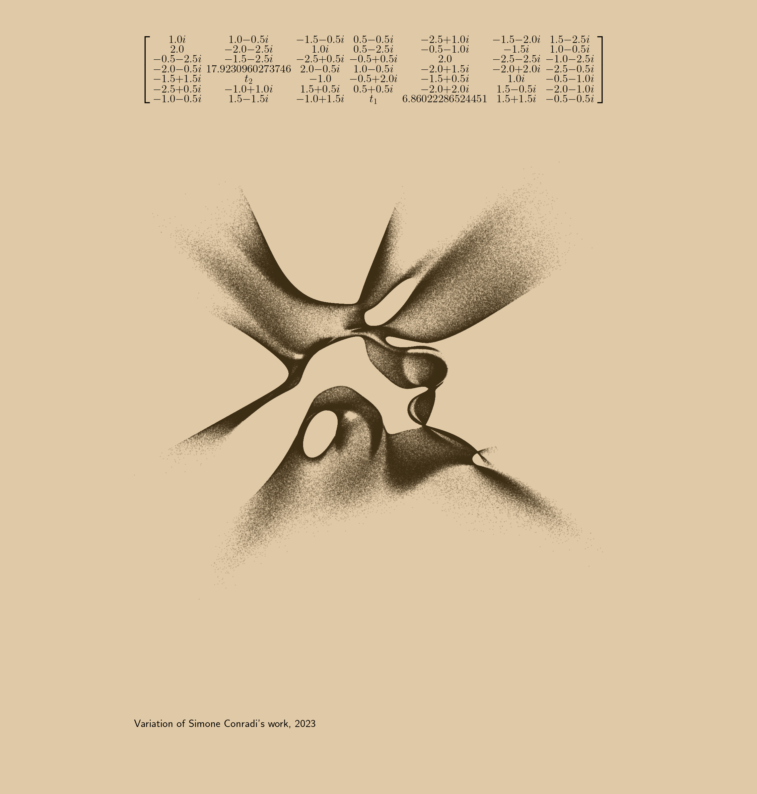
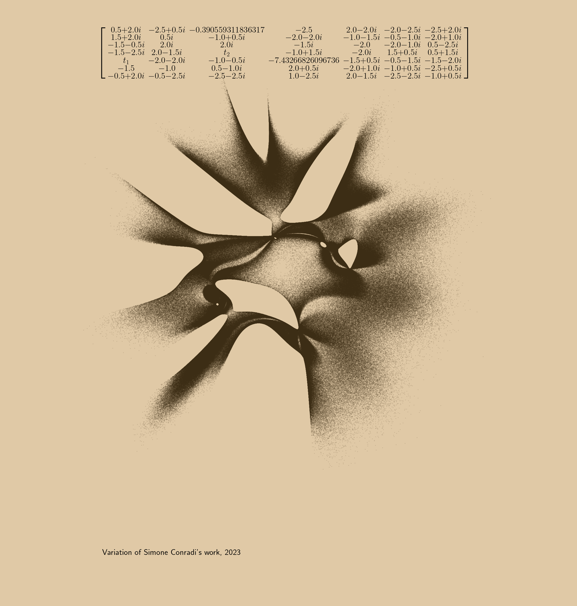

# Simplified Eigenfish

This is a simplified variation of [Eigenfish](https://github.com/profConradi/eigenfish) by Simone Conradi. I made it in order to try to understand how his scripts worked, as I was impressed by the beauty if its plots.

Here are some images generated with this particular variation.

## Plots

